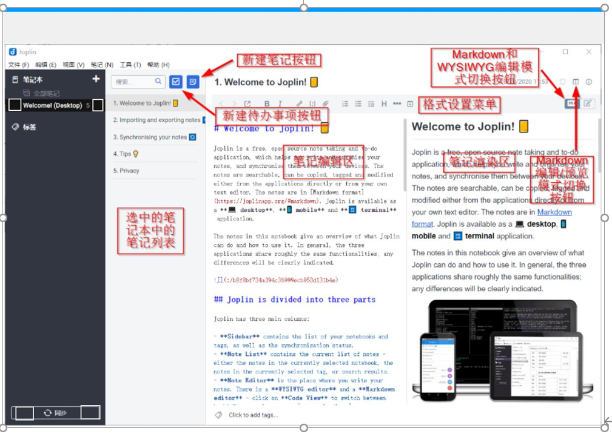

# Never Give Up

---

## 项目前身

​		关于这次实训项目的最终选题的确定，我们经历了多次波折，从很久之前我们就开始选题规划，再经过多方面收集材料和Google后，我们打算做一个类似印象笔记的笔记软件，在平时的时间里，我们已经做了对项目的开发做了一定的分析研究，其中包括类似开源笔记软件的查找、我们项目要实现哪些功能，界面的大致画图等多方面，如以下是根据Joplin软件对当时界面的初步划分：

