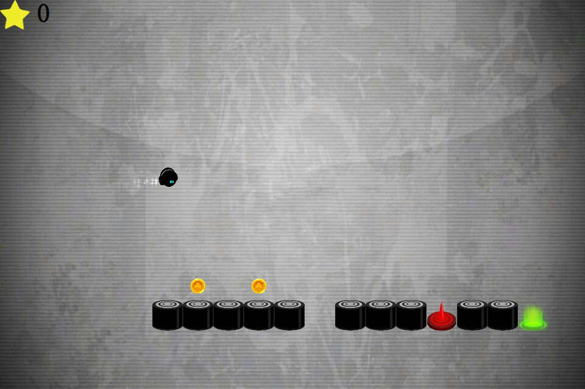

# Never Give Up

## 选题

### 遗憾

​		关于这次实训项目的最终选题的确定，我们经历了多次波折，从很久之前我们就开始选题规划，再经过多方面收集材料和Google后，我们打算做一个类似印象笔记的笔记软件，在平时的时间里，我们已经做了对项目的开发做了一定的分析研究，其中包括类似开源笔记软件的查找、我们项目要实现哪些功能，界面的大致画图等多方面，如以下是根据Joplin软件对当时界面的初步划分：

​		随着时间的推移，我们已经做的内容很多都是看似无用工（实际上也是），没能拿出很实际的东西，临近期末，我们三人经过讨论商量选择了对期末的实训项目进行换题，打算做一个不是特别难的游戏，因此我们才做出了最终的这个选择。

### 最终选题

​		这个换题的决定比较仓促，于是我们的选题来源于平时玩的一个手游——《永不言弃》，因为他是移动端的游戏，所以我们才打算做一个能在电脑上玩的版本。

​		虽然我们是模仿手游开发，大体内容包括素材是来源于《永不言弃》，但是加入了很多自己的创新（在后面的文档里会介绍），我们遍历全网都没有找到桌面端版本，甚至连自制的开发版都没有，没有任何借鉴和参考的地方，所以我们的这个项目算的上是完全独立开发，包括游戏的玩法，涉及到的物理模型都是我们自己建立的。

​		这是一款音乐题材的闯关游戏，游戏难度（并非项目开发难度）就如名字一样，never give up!也算是我们自己现在和以后拥有永不言弃精神的一种激励。

> 游戏界面

## 开发环境

本项目全程都是用Felgo进行开发，游戏的组件和逻辑部分都是使用QML。

## 素材收集

本项目由于是模仿的手游《永不言弃》，因此大多素材来自于此。但是也使用了不同于官方的素材。例如：金币样式、游戏界面、人物、音效等。
